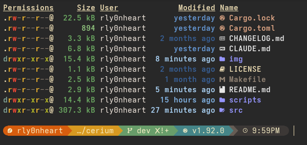
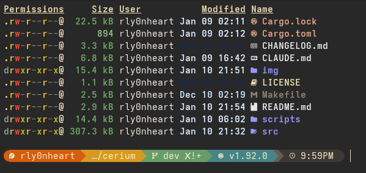

<table>
  <tr>
    <td></td>
    <td></td>
  </tr>
</table>

Yet another ls-like util that is **not** trying to replace `ls`.

Cerium aims to stay small by avoiding features that introduce heavy dependencies while doing what a tool of its kind is supposed to do... list files and directories.

## Installation

### Quick Install (with Cargo)

```bash
# Standard installation with all features
cargo install --git https://github.com/rly0nheart/cerium.git --all-features

# Minimal installation
cargo install --git https://github.com/rly0nheart/cerium.git

# Specific features
cargo install --git https://github.com/rly0nheart/cerium.git --features magic
cargo install --git https://github.com/rly0nheart/cerium.git --features checksum
```

### Build from Source

```bash
git clone https://github.com/rly0nheart/cerium.git
cd cerium
make install
```

## Optional Features

<details>
  <summary><strong>Click</strong></summary>

### Magic

Content-based file type identification using libmagic. Shows actual file types regardless of extension.

**Requirements:** libmagic library (`scripts/install-libmagic.sh`)

```bash
ce --magic
```

### Checksum

Calculate file checksums with multiple algorithms.

**Supported:** `crc32`, `md5`, `sha224`, `sha256`, `sha384`, `sha512`

```bash
ce --checksum sha256
```

</details>

## Usage

<details>
  <summary><strong>Click</strong></summary>

```
ce [OPTIONS] [PATH]
```

### Display Options

```bash
-1, --oneline          One entry per line
-l, --long             Long format (permissions, user, group, size, modified)
-t, --tree             Tree view
-H, --column-headers   Show column headers
```

### Filtering

```bash
-a, --all              Include hidden entries
-d, --dirs             Directories only
-f, --files            Files only
--find <QUERY>         Search for entries that match a query
--hide <ENTRIES>       Exclude specific entries (comma-separated)
--prune                Omit empty directories
```

### Metadata Display

```bash
-p, --permission       File permissions
-u, --user             Owner
-g, --group            Group
-s, --size             File size
-m, --modified         Modification time
-c, --created          Creation time
--accessed             Access time
-i, --inode            Inode number
-b, --blocks           Block count
--hard-links           Hard link count
--acl                  ACL indicator
-x, --xattr            Extended attributes
--mountpoint           Mount point
```

### Sorting & Traversal

```bash
--sort <BY>            name, size, created, accessed, modified, extension, inode
-r, --reverse          Reverse order
-R, --recursive        Recurse into subdirectories
-S, --true-size        Calculate actual directory sizes
```

### Formatting

```bash
--date-fmt <FMT>         locale, human, timestamp
--number-fmt <FMT>       human, natural
--passwd-fmt <FMT>       name, id
--permission-fmt <FMT>   symbolic, octal, hex
--size-fmt <FMT>         bytes, binary, decimal
```

### Appearance

```bash
-C, --colo[u]rs <WHEN>   always, auto, never
-I, --icons <WHEN>       always, auto, never
-Q, --quote-name         auto, double, single, never
```

</details>

## Examples

<details>
  <summary><strong>Click</strong></summary>

### Basic Operations

```bash
ce -la                                    # Long format, all files
ce -t                                     # Tree view
ce -lt --icons=always                     # Tree with metadata and icons
ce --find=.rs --sort=size -r              # Find Rust files, sort by size
```

### Metadata Inspection

```bash
ce -lpug --date-fmt=human                 # Permissions, ownership, human dates
ce -i --hard-links --sort=inode           # Inodes and hard links
ce --acl -x                               # ACLs and extended attributes
ce -lb --block-size                       # Block usage
```

### Advanced Usage

```bash
ce --magic --checksum sha256              # Type detection + checksums
ce -RS --true-size                        # Recursive with actual directory sizes
ce --hide=target,node_modules -t          # Tree excluding build artifacts
ce --permission-fmt=octal -p              # Octal permissions
ce --passwd-fmt=id -ug                    # Numeric UIDs/GIDs
```

### Combined Operations

```bash
ce -laH --date-fmt=human --size-fmt=binary
ce --find=.pdf --checksum md5 --sort=modified -r
ce -t --prune --hide=.git,target --icons=always
```

</details>

## Theme Hacking

<details>
  <summary><strong>Click</strong></summary>

Cerium supports customisable themes via a TOML configuration file. By default, Cerium uses the Gruvbox colour palette.

### Quick Start

```bash
# Apply a pre-made theme
cp themes/dracula.toml ~/.config/cerium.toml
```

### Available Themes

See [`themes/README.md`](themes/README.md) for the full list of pre-made themes, installation instructions, and customisation guide.

</details>

## License
### MIT License

See [license details](https://choosealicense.com/licenses/mit/) for more information.

## Credits
- My mentor, [Ned Williamson](https://github.com/nedwill), for his guidance and ongoing feedback on the project
- Borrowed icon constants from [eza-community/eza](https://github.com/eza-community/eza) (I'm sure they don't mind... right?)
- Nerd Font icons courtesy of [ryanoasis/nerd-fonts](https://github.com/ryanoasis/nerd-fonts) (Where would we be without symbols?)